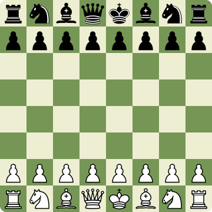

<div align="center">

# ♟ ChessKernel

**The open-source chess platform you actually control.**  
Real-time multiplayer · Stockfish analysis · Zero subscriptions.

[](https://github.com/mateuseap/chesskernel/actions)
[](https://github.com/mateuseap/chesskernel/releases)
[](LICENSE)
[](https://github.com/mateuseap/chesskernel/stargazers)
[](https://github.com/mateuseap/chesskernel)

<br />



<br />

</div>

---

## Why ChessKernel?

Chess platforms today lock features behind subscriptions, harvest your game data, and push ads on free users. ChessKernel is different — it runs entirely on your own server, gives every user the full experience for free, and keeps your games in a database you control.

- **No subscriptions.** Every feature is available to every user.
- **No ads, no tracking.** Your games belong to you.
- **Own your data.** PostgreSQL, full PGN export, no vendor lock-in.
- **Batteries included.** Stockfish engine, ELO matchmaking, and Glicko-2 ratings out of the box.

## Features

|  |  |
|--|--|
| ⚡ **Real-time Multiplayer** | WebSocket-powered live games with spectator support |
| 🤖 **Stockfish Engine** | Play against the world's strongest engine at any difficulty |
| 📊 **Game Analysis** | Move-by-move review with brilliant / good / mistake / blunder classifications |
| 🏆 **Rating System** | Glicko-2 with separate ladders for bullet, blitz, rapid, and classical |
| 👥 **Social** | Friend system, game invitations, shareable challenge links |
| 📜 **Game History** | Full archive with PGN export |
| 🌍 **Multilingual** | English, Portuguese, and Spanish |
| 🐳 **Docker-first** | One command to run the entire stack |

## Quick Start

```bash
git clone https://github.com/mateuseap/chesskernel.git && cd chesskernel
cp .env.example .env          # fill in your secrets
docker compose -f docker/docker-compose.prod.yml up -d
```

Open `http://localhost` — that's it.

> Full configuration options, environment variables, and development setup: [docs/deployment/setup.md](docs/deployment/setup.md)

## Stack

| Layer | Technology |
|-------|-----------|
| Frontend | React 18, Vite, TypeScript, Tailwind CSS, shadcn/ui |
| Backend | NestJS, TypeScript, Prisma ORM |
| Database | PostgreSQL |
| Cache & Pub/Sub | Redis |
| Realtime | Socket.IO |
| Chess Engine | chess.js + Stockfish (binary / WASM) |
| DevOps | Docker, Nginx, GitHub Actions |

## Documentation

| Doc | Description |
|-----|------------|
| [System Overview](docs/architecture/overview.md) | Architecture diagram and component map |
| [System Design](docs/architecture/system-design.md) | Sequences, state machines, scaling plan |
| [Backend Architecture](docs/backend/backend-architecture.md) | Module map, auth flow, game state machine |
| [Frontend Architecture](docs/frontend/architecture.md) | Component tree, data flow, i18n |
| [Database Schema](docs/database/database-schema.md) | ER diagram and table definitions |
| [API Contracts](docs/api/api-contracts.md) | REST endpoints and Socket.IO events |
| [Security](docs/security/security.md) | Auth model, move validation, rate limiting |
| [Deployment Guide](docs/deployment/setup.md) | Docker setup, environment variables |

## Contributing

Read [CONTRIBUTING.md](CONTRIBUTING.md) and [docs/development/git-workflow.md](docs/development/git-workflow.md) before opening a PR. The `develop` branch is the integration target; `main` is production-stable.

## License

MIT — see [LICENSE](LICENSE).
