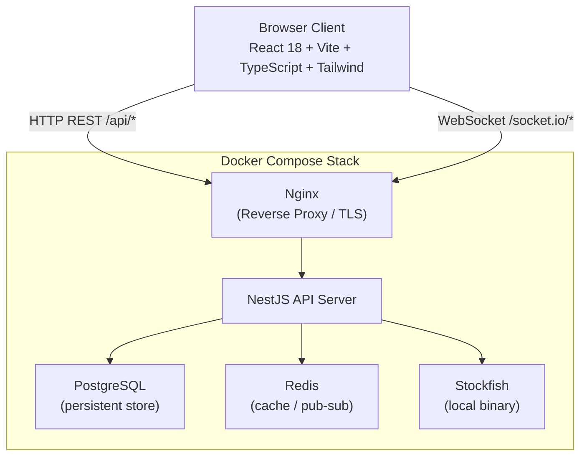

# System Overview

ChessKernel is a real-time, open-source chess platform. All services run within a single Docker Compose stack with no external paid APIs.

## High-Level Architecture

## Component Responsibilities

### Client
- Renders game board and UI
- Manages WebSocket connection lifecycle
- Optimistically updates local game state via chess.js
- Sends moves and receives authoritative server state

### Nginx
- Proxies REST requests to NestJS on `/api/*`
- Proxies WebSocket upgrades to NestJS on `/socket.io/*`
- Serves frontend static bundle
- Enforces rate limits per IP

### NestJS API
- Authoritative game state machine
- Validates all moves server-side via chess.js
- Issues and validates JWT tokens
- Orchestrates matchmaking queues via Redis
- Dispatches Stockfish analysis jobs
- Pushes real-time events through Socket.IO

### PostgreSQL
- Authoritative persistent store
- Stores users, games, moves, ratings, friends, invitations

### Redis
- Matchmaking queue state (Sorted Sets)
- Active game state cache (fast reads for reconnects)
- Socket room membership
- Pub/Sub for horizontal scaling of WebSocket servers

### Stockfish
- Local binary invoked by analysis service
- UCI protocol communication via child_process
- Used for bot games and post-game analysis

## Key Design Decisions

See [ADRs](../adr/) for detailed decision records.

| Decision | Choice | Rationale |
|----------|--------|-----------|
| Realtime transport | Socket.IO | Fallback support, rooms, namespaces |
| Rating system | Glicko-2 | Standard in competitive chess, handles inactivity |
| Chess validation | Server-side chess.js | Prevents cheating; client uses chess.js optimistically |
| Bot engine | Stockfish binary | Best open-source engine; WASM fallback for dev |
| Auth | JWT + refresh tokens | Stateless, works with horizontal scaling |
| ORM | Prisma | Type-safe, excellent migration tooling |
| Queue | Redis Sorted Sets | O(log n) insert/dequeue by rating |
