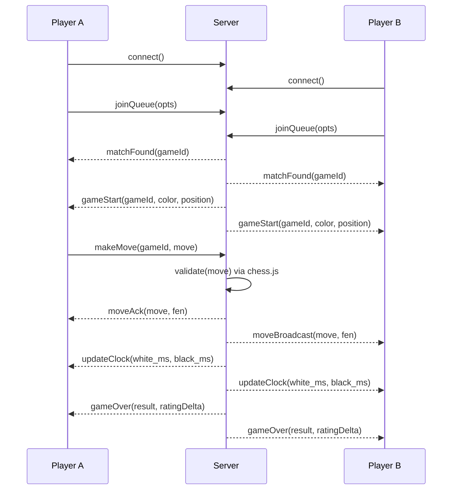
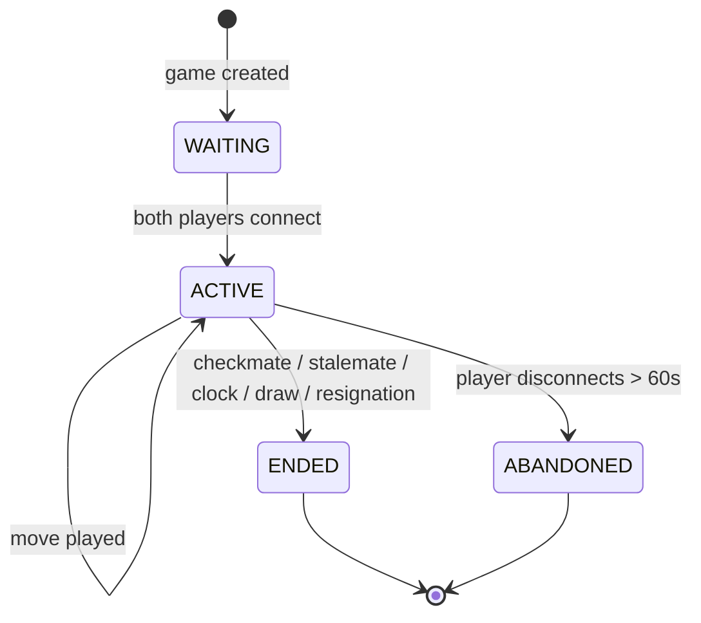
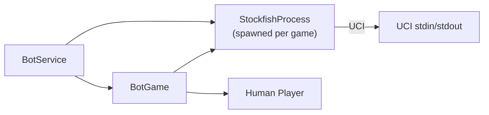
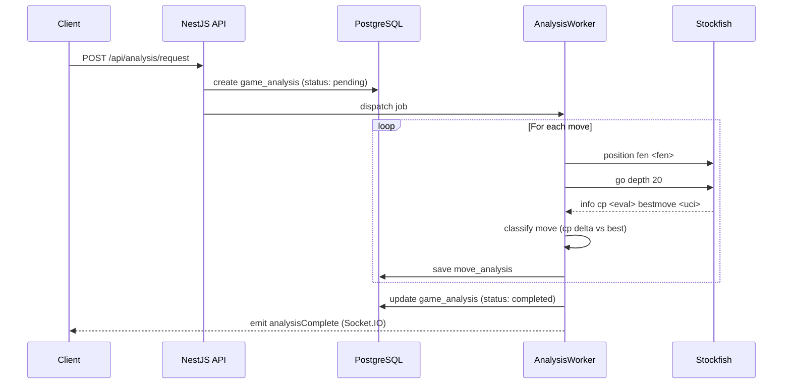
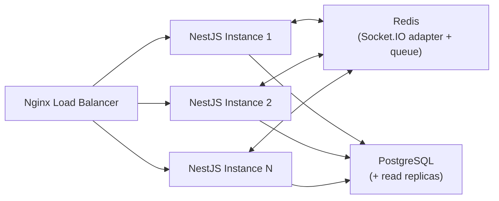

# System Design

## Real-Time Game Flow



## Matchmaking System

### Queue Structure (Redis)

```
ZADD matchmaking:{timeControl} {rating} {userId}
```

- One sorted set per time control (bullet_1_0, blitz_3_2, rapid_10_0, etc.)
- Rating is the Z-score, which enables O(log n) range queries
- Polling interval: 500ms worker checks for compatible players

### Match Algorithm

```
1. Player joins queue with rating R and time control T
2. Worker scans ZRANGEBYSCORE within [R-100, R+100]
3. If match found → create game, remove both from queue
4. If no match after 30s → expand range by ±50 per 10s
5. Max range: ±400 rating points
```

### Game State Machine



## Rating System (Glicko-2)

Implementation based on Mark Glickman's original paper.

### Parameters

| Symbol | Meaning | Default |
|--------|---------|---------|
| μ | Rating (displayed as μ × 173.7178 + 1500) | 0 |
| φ | Rating deviation | 2.014761872 (≈350 displayed) |
| σ | Volatility | 0.06 |
| τ | System constant | 0.5 |

Ratings update immediately after each game. New player defaults: rating 1200, RD 350, volatility 0.06.

## Bot System Architecture



### Difficulty Levels

| Level | Skill Level (UCI) | Depth | Move Time (ms) |
|-------|------------------|-------|----------------|
| Beginner | 0 | 1 | 100 |
| Easy | 5 | 3 | 200 |
| Medium | 10 | 5 | 500 |
| Hard | 15 | 10 | 1000 |
| Expert | 20 | 15 | 2000 |
| Maximum | 20 | unlimited | 3000 |

## Analysis Pipeline



Move classification thresholds (centipawn drop from best move):

| Classification | CP Drop |
|----------------|---------|
| Brilliant | engine says sub-optimal but tactically sharp |
| Best / Excellent | 0-10 |
| Good | 10-25 |
| Inaccuracy | 25-100 |
| Mistake | 100-300 |
| Blunder | >300 |
| Book | matches opening book |

## WebSocket Event System

### Namespaces

- `/game`: active game events
- `/matchmaking`: queue and match events
- `/notifications`: friend requests, invitations, alerts

### Room Structure

- `game:{gameId}`: players and spectators of a game
- `user:{userId}`: private user channel
- `leaderboard`: live leaderboard updates

### Key Events

| Event | Direction | Payload |
|-------|-----------|---------|
| `game:move` | client→server | `{gameId, move: {from, to, promotion?}}` |
| `game:move:broadcast` | server→room | `{move, fen, clock}` |
| `game:over` | server→room | `{result, winner?, pgn}` |
| `game:clock` | server→room | `{white: ms, black: ms}` |
| `game:draw:offer` | client→server | `{gameId}` |
| `game:resign` | client→server | `{gameId}` |
| `queue:join` | client→server | `{timeControl, variant}` |
| `queue:leave` | client→server | `{}` |
| `queue:matched` | server→client | `{gameId}` |

## Redis Caching Strategy

| Key Pattern | Type | TTL | Purpose |
|-------------|------|-----|---------|
| `game:{id}:state` | Hash | 2h | Active game FEN + clocks |
| `game:{id}:players` | Hash | 2h | Player socket IDs |
| `user:{id}:session` | String | 7d | JWT refresh token |
| `matchmaking:{tc}` | ZSet | - | Matchmaking queue |
| `leaderboard:{tc}` | ZSet | 5m | Cached ranking |
| `user:{id}:online` | String | 30s | Online presence (heartbeat) |

## Scalability Plan

### Current: Single Node

All services on one Docker Compose stack. Sufficient for thousands of concurrent games.

### Horizontal Scaling Path



Steps:
1. Add Redis Pub/Sub adapter (`@socket.io/redis-adapter`)
2. Run multiple NestJS instances behind Nginx load balancer
3. PostgreSQL read replicas for leaderboard queries
4. Stockfish worker pool via BullMQ over Redis

The Redis adapter is already architected into the WebSocket gateway so scaling requires only configuration, no code changes.
