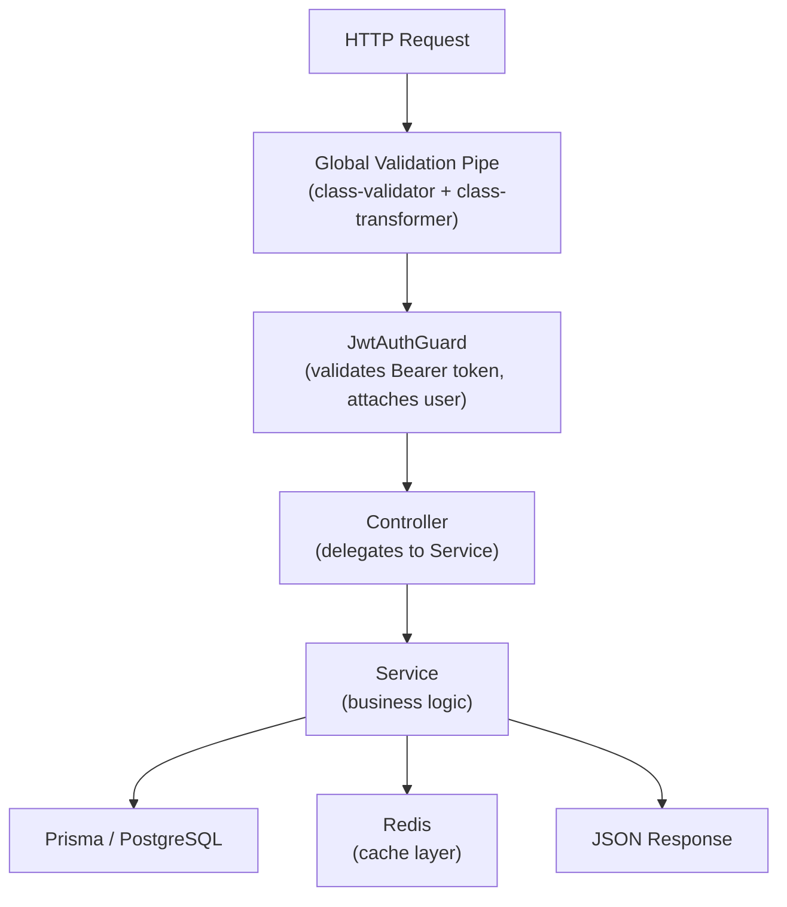
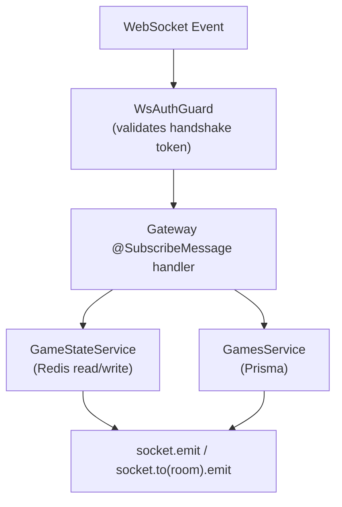
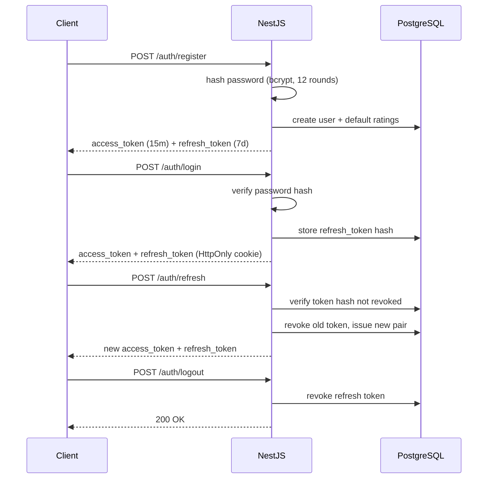
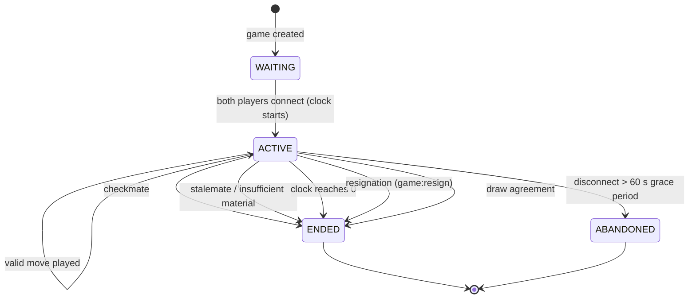
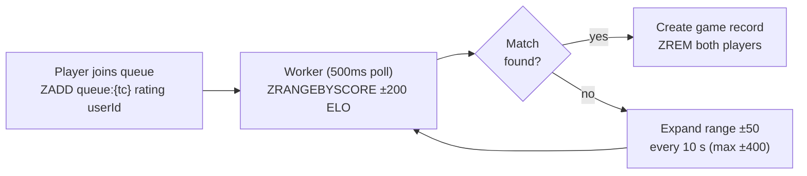
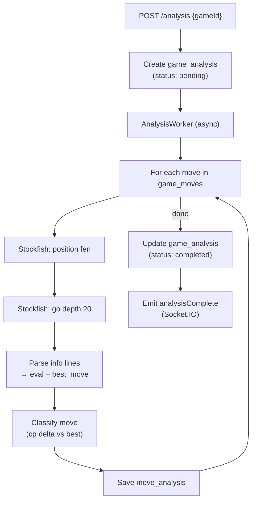

# Backend Architecture

## Module Map

```
server/src/
├── app.module.ts          # Root module: wires everything together
├── main.ts                # Bootstrap: NestJS app, Prisma hooks, validation pipe
├── common/                # Guards, decorators, interceptors, filters
│   ├── guards/            # JwtAuthGuard, WsAuthGuard
│   ├── decorators/        # @CurrentUser(), @Public()
│   └── filters/           # AllExceptionsFilter (WS + HTTP)
├── config/                # ConfigModule wrappers (env validation)
├── database/              # Prisma service (singleton, lifecycle hooks)
├── modules/
│   ├── auth/              # JWT issue/refresh/revoke, bcrypt hashing
│   ├── users/             # Profile read/update, search
│   ├── games/             # Game lookup, history
│   ├── matchmaking/       # ELO queue (Redis Sorted Sets), bot game spawn
│   ├── analysis/          # Stockfish UCI dispatcher, move classification
│   ├── friends/           # Friend requests, accept, list
│   ├── invitations/       # Token-based game invites
│   ├── leaderboards/      # Top-N by time control
│   ├── notifications/     # In-app notification store
│   └── ratings/           # Glicko-2 update (called on game end)
└── websocket/
    ├── game.gateway.ts    # All in-game Socket.IO events
    └── queue.gateway.ts   # Matchmaking events
```

## Request Lifecycle





## Auth Flow



Access token: JWT signed with `JWT_SECRET`, 15-minute TTL.  
Refresh token: opaque random bytes, stored as SHA-256 hash in `refresh_tokens`.

## Game State Machine



Active game state is cached in Redis (`game:{id}`) for O(1) reconnect. PostgreSQL is authoritative; Redis is repopulated from DB on cache miss.

## Matchmaking



## Analysis Pipeline



Move classification thresholds (centipawn eval drop from best move):

| Classification | CP Drop |
|----------------|---------|
| Brilliant | sub-optimal but tactically sharp (heuristic) |
| Best / Excellent | 0-10 |
| Good | 10-25 |
| Inaccuracy | 25-100 |
| Mistake | 100-300 |
| Blunder | >300 |
| Book | matches opening book |

## Rating System (Glicko-2)

After each ranked game:
1. Fetch `user_ratings` for both players (rating, φ, σ)
2. Run Glicko-2 update: single-game period
3. Clamp φ between 30 and 350
4. Write new rating values + `games_played++`

Bot games do not affect ratings.

## Key Dependencies

| Package | Purpose |
|---------|---------|
| `@nestjs/core` | DI, module system, lifecycle |
| `@nestjs/jwt` | JWT sign/verify |
| `@nestjs/websockets` + `socket.io` | WebSocket gateway |
| `@prisma/client` | Type-safe DB client |
| `ioredis` | Redis client |
| `chess.js` | Server-side move validation |
| `bcrypt` | Password hashing |
| `class-validator` / `class-transformer` | DTO validation pipeline |
| `zod` | Config env validation |
