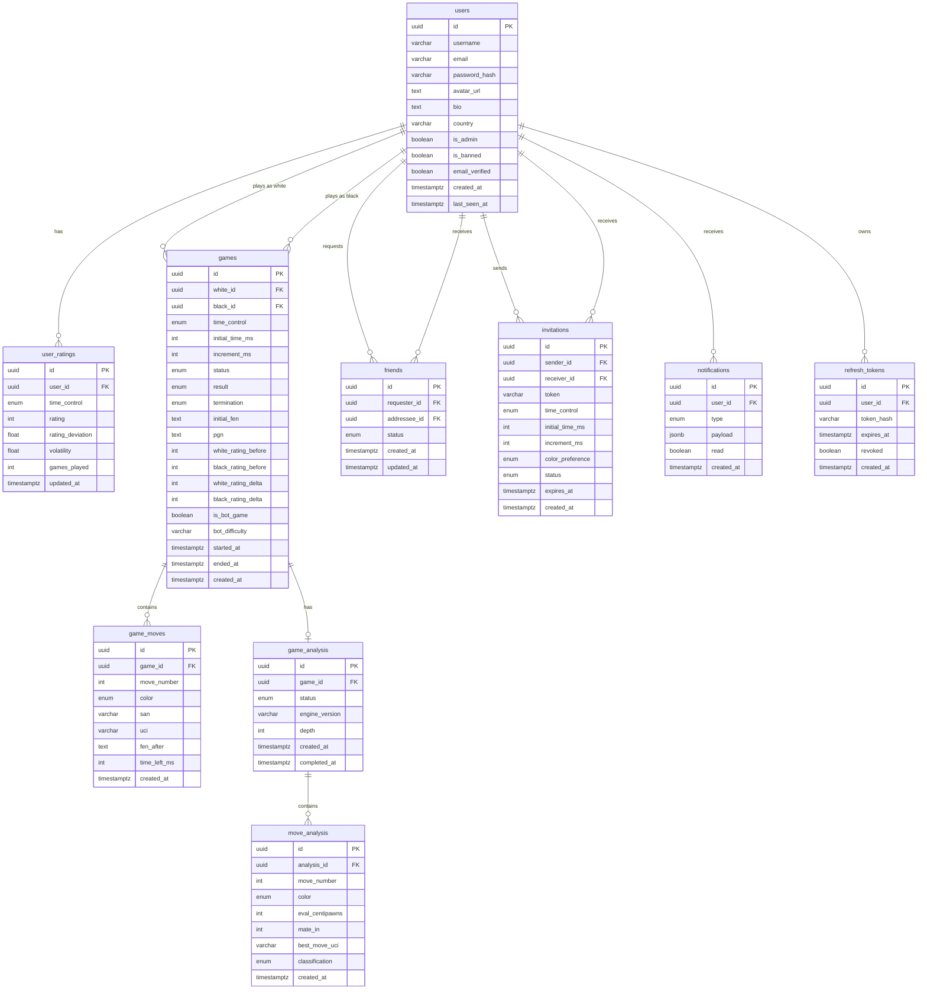

# Database Schema

## Entity Relationship Diagram



## Tables

### users
| Column | Type | Notes |
|--------|------|-------|
| id | UUID PK | |
| username | VARCHAR(30) | unique, indexed |
| email | VARCHAR(255) | unique, indexed |
| password_hash | VARCHAR(255) | bcrypt |
| avatar_url | TEXT | nullable |
| bio | TEXT | nullable |
| country | VARCHAR(2) | ISO 3166-1 alpha-2 |
| is_admin | BOOLEAN | default false |
| is_banned | BOOLEAN | default false |
| email_verified | BOOLEAN | default false |
| created_at | TIMESTAMPTZ | |
| last_seen_at | TIMESTAMPTZ | |

### user_ratings
| Column | Type | Notes |
|--------|------|-------|
| id | UUID PK | |
| user_id | UUID FK → users | |
| time_control | ENUM | bullet/blitz/rapid/classical |
| rating | INTEGER | default 1200 |
| rating_deviation | FLOAT | Glicko-2 φ, default 350 |
| volatility | FLOAT | Glicko-2 σ, default 0.06 |
| games_played | INTEGER | default 0 |
| updated_at | TIMESTAMPTZ | |

### games
| Column | Type | Notes |
|--------|------|-------|
| id | UUID PK | |
| white_id | UUID FK → users | nullable (bot) |
| black_id | UUID FK → users | nullable (bot) |
| time_control | ENUM | |
| initial_time_ms | INTEGER | e.g. 180000 for 3min |
| increment_ms | INTEGER | e.g. 2000 for +2s |
| status | ENUM | waiting/active/ended/abandoned |
| result | ENUM | white/black/draw/abandoned, nullable |
| termination | ENUM | checkmate/timeout/resignation/draw_agreement/stalemate/insufficient/abandoned, nullable |
| initial_fen | TEXT | standard starting position unless variant |
| pgn | TEXT | populated on game end |
| white_rating_before | INTEGER | nullable |
| black_rating_before | INTEGER | nullable |
| white_rating_delta | INTEGER | nullable |
| black_rating_delta | INTEGER | nullable |
| is_bot_game | BOOLEAN | default false |
| bot_difficulty | VARCHAR(20) | nullable |
| started_at | TIMESTAMPTZ | nullable |
| ended_at | TIMESTAMPTZ | nullable |
| created_at | TIMESTAMPTZ | |

### game_moves
| Column | Type | Notes |
|--------|------|-------|
| id | UUID PK | |
| game_id | UUID FK → games | indexed |
| move_number | INTEGER | |
| color | ENUM | white/black |
| san | VARCHAR(10) | Standard Algebraic Notation |
| uci | VARCHAR(5) | e.g. "e2e4" |
| fen_after | TEXT | board state after move |
| time_left_ms | INTEGER | clock after move |
| created_at | TIMESTAMPTZ | |

### game_analysis
| Column | Type | Notes |
|--------|------|-------|
| id | UUID PK | |
| game_id | UUID FK → games | unique |
| status | ENUM | pending/processing/completed/failed |
| engine_version | VARCHAR(20) | Stockfish version |
| depth | INTEGER | analysis depth |
| created_at | TIMESTAMPTZ | |
| completed_at | TIMESTAMPTZ | nullable |

### move_analysis
| Column | Type | Notes |
|--------|------|-------|
| id | UUID PK | |
| analysis_id | UUID FK → game_analysis | indexed |
| move_number | INTEGER | |
| color | ENUM | white/black |
| eval_centipawns | INTEGER | nullable (mate score uses mate_in) |
| mate_in | INTEGER | nullable |
| best_move_uci | VARCHAR(5) | |
| classification | ENUM | best/excellent/good/inaccuracy/mistake/blunder/book |
| created_at | TIMESTAMPTZ | |

### friends
| Column | Type | Notes |
|--------|------|-------|
| id | UUID PK | |
| requester_id | UUID FK → users | |
| addressee_id | UUID FK → users | |
| status | ENUM | pending/accepted/blocked |
| created_at | TIMESTAMPTZ | |
| updated_at | TIMESTAMPTZ | |
| UNIQUE | (requester_id, addressee_id) | |

### invitations
| Column | Type | Notes |
|--------|------|-------|
| id | UUID PK | |
| sender_id | UUID FK → users | |
| receiver_id | UUID FK → users | nullable (open invite) |
| token | VARCHAR(64) | unique, for link-based invites |
| time_control | ENUM | |
| initial_time_ms | INTEGER | |
| increment_ms | INTEGER | |
| color_preference | ENUM | white/black/random |
| status | ENUM | pending/accepted/declined/expired |
| expires_at | TIMESTAMPTZ | |
| created_at | TIMESTAMPTZ | |

### notifications
| Column | Type | Notes |
|--------|------|-------|
| id | UUID PK | |
| user_id | UUID FK → users | indexed |
| type | ENUM | friend_request/game_invite/game_ended/etc |
| payload | JSONB | type-specific data |
| read | BOOLEAN | default false |
| created_at | TIMESTAMPTZ | |

### refresh_tokens
| Column | Type | Notes |
|--------|------|-------|
| id | UUID PK | |
| user_id | UUID FK → users | indexed |
| token_hash | VARCHAR(255) | SHA-256 of token |
| expires_at | TIMESTAMPTZ | |
| revoked | BOOLEAN | default false |
| created_at | TIMESTAMPTZ | |

## Indexes

```sql
CREATE INDEX idx_games_white_id ON games(white_id);
CREATE INDEX idx_games_black_id ON games(black_id);
CREATE INDEX idx_games_status ON games(status);
CREATE INDEX idx_game_moves_game_id ON game_moves(game_id);
CREATE INDEX idx_user_ratings_user_time ON user_ratings(user_id, time_control);
CREATE INDEX idx_user_ratings_rating ON user_ratings(rating DESC);
CREATE INDEX idx_friends_requester ON friends(requester_id);
CREATE INDEX idx_friends_addressee ON friends(addressee_id);
CREATE INDEX idx_notifications_user_unread ON notifications(user_id) WHERE read = false;
CREATE INDEX idx_invitations_token ON invitations(token);
CREATE INDEX idx_invitations_receiver ON invitations(receiver_id);
```
