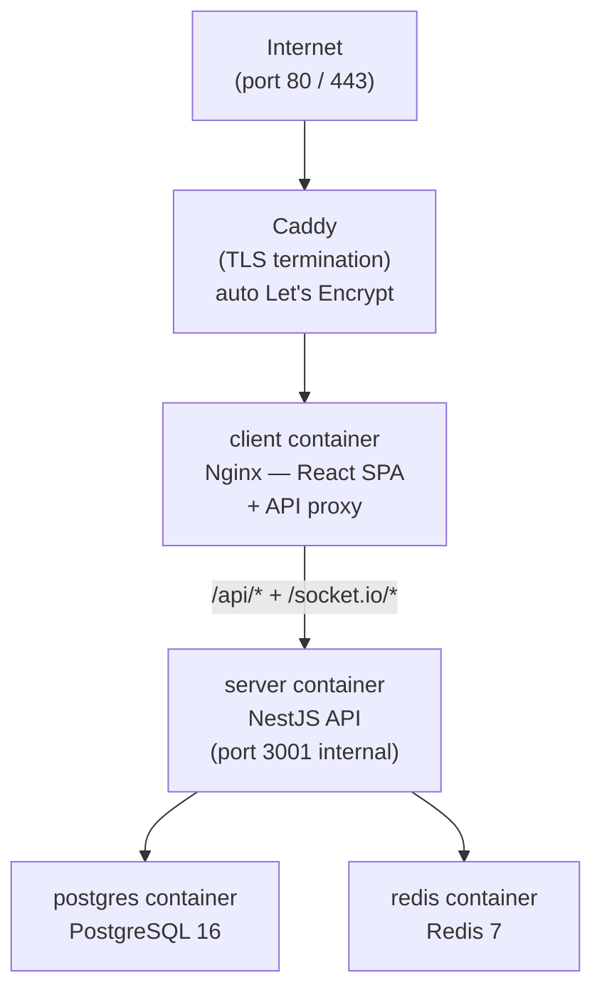

# Deployment Guide

## Architecture



| Container | Image / Build | Role |
|-----------|--------------|------|
| `caddy` | `caddy:2-alpine` | TLS termination, HTTP → HTTPS redirect |
| `client` | `Dockerfile.client` | Nginx serving React bundle, proxies API/WS |
| `server` | `Dockerfile.server` | NestJS REST + Socket.IO, Stockfish analysis |
| `postgres` | `postgres:16-alpine` | Primary database |
| `redis` | `redis:7-alpine` | Matchmaking queue, game state cache |

All services run inside Docker and communicate on a private network. Only Caddy is exposed to the internet.

---

## Prerequisites

| Tool | Min version |
|------|-------------|
| Docker | 24.x |
| Docker Compose | 2.x |
| Domain | A record pointing to your server IP |

Stockfish is installed inside the `server` container via `apk add stockfish` — no host install needed.

---

## First Deploy

### 1. Provision a server

A 2 vCPU / 4 GB RAM instance is sufficient for hundreds of concurrent games.

Popular choices: Hetzner CX22 ($6/mo), DigitalOcean Droplet Basic, Linode Nanode 4 GB.

Install Docker:
```bash
curl -fsSL https://get.docker.com | sh
```

### 2. Point your domain

Create an **A record** for `chess.yourdomain.com` → your server IP.
Caddy will automatically obtain a TLS certificate from Let's Encrypt once DNS propagates (usually under 2 minutes).

### 3. Clone and configure

```bash
git clone https://github.com/mateuseap/chesskernel.git
cd chesskernel
cp .env.example .env
```

Edit `.env` — replace every placeholder value:

```env
POSTGRES_USER=chesskernel
POSTGRES_PASSWORD=<strong password>
POSTGRES_DB=chesskernel

REDIS_PASSWORD=<strong password>

# Generate with: openssl rand -hex 64
JWT_SECRET=<64 hex chars>
JWT_ACCESS_EXPIRES_IN=15m
JWT_REFRESH_EXPIRES_IN=7d

CLIENT_ORIGIN=https://chess.yourdomain.com
DOMAIN=chess.yourdomain.com
```

### 4. Build and start

```bash
docker compose -f docker/docker-compose.prod.yml up -d --build
```

This builds the client and server images, starts all five containers, and runs `prisma migrate deploy` automatically inside the server container before the app starts.

### 5. Verify

```bash
# All containers should be Up (healthy)
docker compose -f docker/docker-compose.prod.yml ps

# Server logs show migration output on first boot
docker compose -f docker/docker-compose.prod.yml logs server

# Smoke test
curl https://chess.yourdomain.com/api/leaderboards/blitz
# → {"games":[...]}
```

---

## Updating

```bash
git pull
docker compose -f docker/docker-compose.prod.yml up -d --build
```

Migrations run automatically on server start.

---

## Environment Variables Reference

| Variable | Required | Default | Description |
|----------|----------|---------|-------------|
| `POSTGRES_USER` | Yes | — | PostgreSQL username |
| `POSTGRES_PASSWORD` | Yes | — | PostgreSQL password |
| `POSTGRES_DB` | Yes | — | PostgreSQL database name |
| `REDIS_PASSWORD` | Yes | — | Redis auth password |
| `JWT_SECRET` | Yes | — | Access token signing key (64+ hex chars) |
| `JWT_ACCESS_EXPIRES_IN` | No | `15m` | Access token TTL |
| `JWT_REFRESH_EXPIRES_IN` | No | `7d` | Refresh token TTL |
| `CLIENT_ORIGIN` | Yes | — | Allowed CORS origin — must match your public URL |
| `DOMAIN` | Yes | — | Public domain (used by Caddy for TLS cert) |

---

## Custom Stockfish Binary

The server image installs Stockfish via Alpine's package manager. To use a newer binary, place it at `server/bin/stockfish` — the container mounts this directory at `/app/bin/` and checks it first before the system path.

```bash
wget https://... -O server/bin/stockfish
chmod +x server/bin/stockfish
docker compose -f docker/docker-compose.prod.yml restart server
```

---

## Development Setup

```bash
pnpm install
cp .env.example .env

# Start only PostgreSQL + Redis
docker compose -f docker/docker-compose.dev.yml up -d

# Apply migrations
pnpm --filter server db:migrate

# Hot-reload dev server for all packages
pnpm dev
```

Frontend: `http://localhost:5173` — Backend: `http://localhost:3001`

For local analysis, install Stockfish on the host:
```bash
sudo apt install stockfish   # Ubuntu/Debian
brew install stockfish       # macOS
```

---

## Backup and Restore

```bash
# Dump
docker compose -f docker/docker-compose.prod.yml exec postgres \
  pg_dump -U chesskernel chesskernel > backup-$(date +%Y%m%d).sql

# Restore
docker compose -f docker/docker-compose.prod.yml exec -T postgres \
  psql -U chesskernel chesskernel < backup-20260701.sql
```

Daily cron example:
```
0 3 * * * cd /srv/chesskernel && docker compose -f docker/docker-compose.prod.yml exec -T postgres pg_dump -U chesskernel chesskernel > /backups/ck-$(date +\%Y\%m\%d).sql
```

---

## Logs

```bash
docker compose -f docker/docker-compose.prod.yml logs -f          # all
docker compose -f docker/docker-compose.prod.yml logs -f server   # NestJS
docker compose -f docker/docker-compose.prod.yml logs -f caddy    # TLS / access
```

---

## Health Checks

| Check | Expected |
|-------|----------|
| `GET /api/leaderboards/blitz` | 200 JSON |
| `GET /` | 200 HTML (React SPA) |
| `docker compose ps` | All containers `Up (healthy)` |

PostgreSQL and Redis have built-in Compose healthchecks. The `server` container waits for both before starting.

---

## Nginx Configuration

`docker/nginx/nginx.client.conf` is bundled inside the `client` container. It:

- Serves the React SPA with SPA fallback (`try_files $uri /index.html`)
- Proxies `/api/*` → `server:3001`
- Proxies `/socket.io/*` → `server:3001` with WebSocket upgrade headers
- Rate-limits `/api/auth/*` to 5 req/min per IP (brute-force protection)
- Sets 1-year immutable cache headers on static assets

TLS is handled entirely by Caddy — Nginx only speaks plain HTTP on the internal Docker network.

## Performance notes

- Nginx gzips text assets and proxied JSON responses (level 5, min 1 KB), keeping compression off the Node event loop
- The client build code-splits vendor, board, chess-logic, i18n, and UI chunks; heavy pages (analysis, play) are lazy-loaded routes
- Database indexes back the two hottest lookups: refresh-token validation and the leaderboard (timeControl, rating DESC) query
- Socket handlers read game state through a trimmed core selection (no full move list per event)
