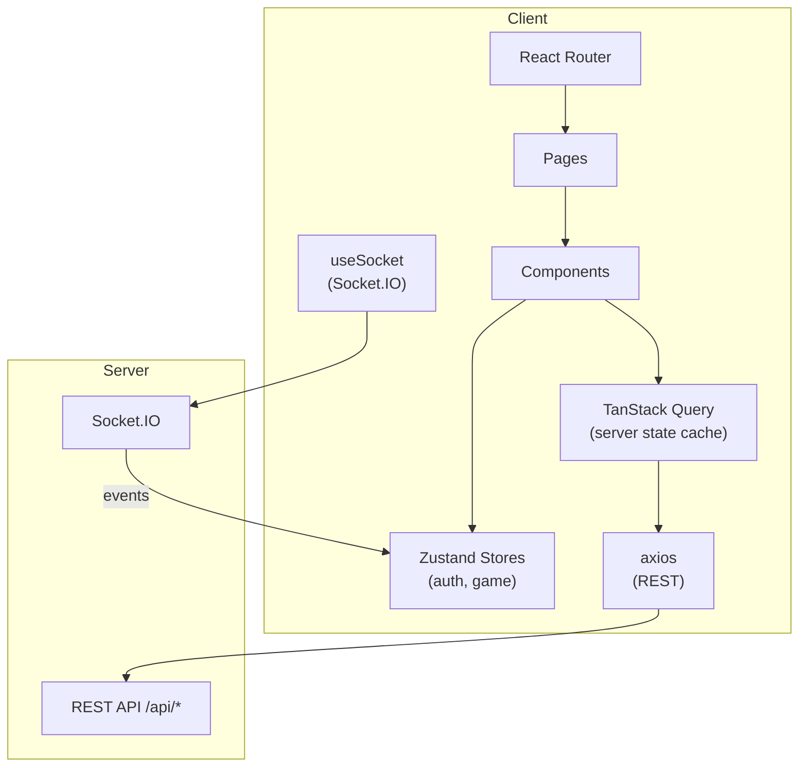
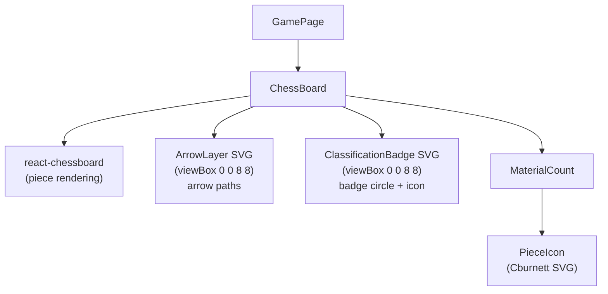
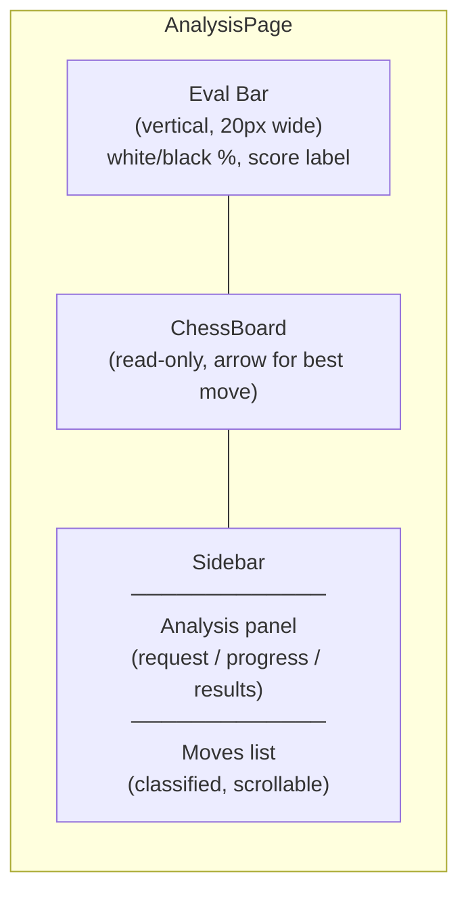
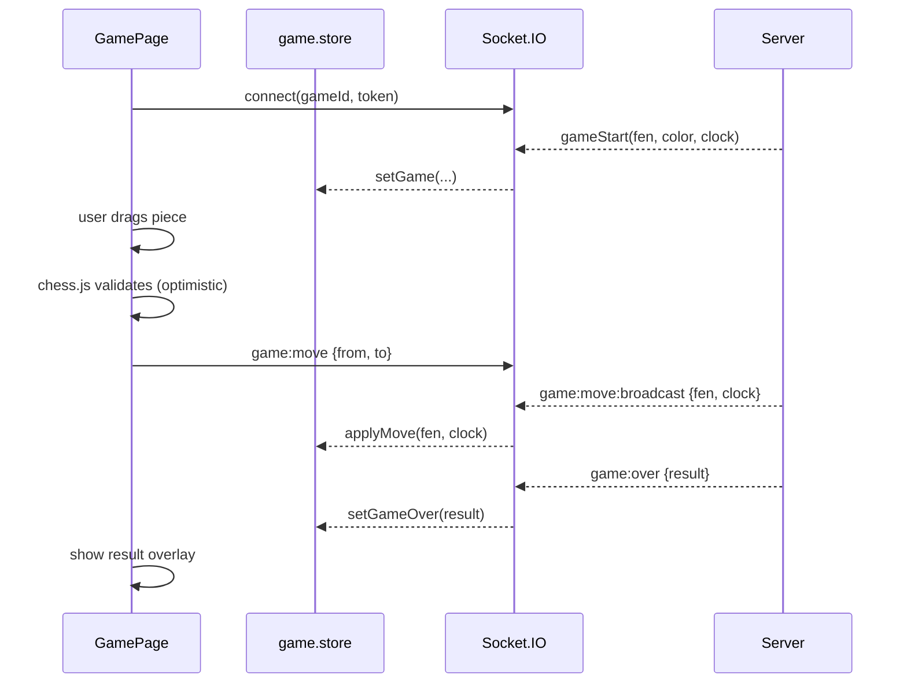

# Frontend Architecture

## Tech Stack

| Layer | Choice |
|-------|--------|
| Framework | React 18 |
| Build | Vite 5 |
| Language | TypeScript 5 |
| Styling | Tailwind CSS v3 |
| State | Zustand |
| Server state | TanStack Query v5 |
| Routing | React Router v6 |
| WebSocket | Socket.IO client |
| Chess logic | chess.js |
| Board UI | react-chessboard |
| i18n | react-i18next |
| HTTP | axios |

## Application Structure

```
client/src/
├── app/
│   ├── globals.css          # Tailwind base + custom animations
│   └── router.tsx           # Route definitions
├── components/
│   ├── chess/
│   │   ├── ChessBoard.tsx   # Board + arrow SVG overlay + badges
│   │   ├── MaterialCount.tsx # Captured pieces + advantage display
│   │   └── PieceIcon.tsx    # Cburnett SVG piece components
│   ├── layout/
│   │   └── Navbar.tsx
│   └── ui/                  # shadcn/ui primitives
├── hooks/
│   └── useSocket.ts         # Socket.IO connection lifecycle
├── i18n/
│   ├── i18n.ts              # i18next init
│   └── locales/
│       ├── en.json
│       ├── pt.json
│       └── es.json
├── pages/
│   ├── AnalysisPage.tsx     # Post-game Stockfish analysis
│   ├── GamePage.tsx         # Live game board
│   ├── HomePage.tsx         # Landing page
│   ├── LeaderboardPage.tsx
│   ├── LoginPage.tsx
│   ├── PlayPage.tsx         # Matchmaking / bot game setup
│   ├── ProfilePage.tsx
│   └── RegisterPage.tsx
├── queries/                 # TanStack Query hooks (api calls)
├── services/
│   └── api.ts               # axios instance
└── stores/
    ├── auth.store.ts        # JWT + user identity
    └── game.store.ts        # Active game state
```

## Data Flow



## State Management Split

| State type | Tool | Rationale |
|-----------|------|-----------|
| Auth (user, token) | Zustand | Persisted, shared globally |
| Active game (fen, clocks, moves) | Zustand | Updated by Socket.IO events |
| Server data (profiles, history) | TanStack Query | Cache, refetch, deduplication |
| UI-local (modals, hover) | useState | No need to share |

## Chess Board Component



Key design decisions:
- Arrow and badge SVGs share the same `viewBox="0 0 8 8"` coordinate space as the board grid, so square positions map directly without percentage calculations.
- `ClassificationBadge` is a standalone SVG overlay, independent of `ArrowLayer`, so badges always render even when there are no arrows on the board.
- `MaterialCount` renders captured piece icons using inline SVG paths (Cburnett set, CC BY-SA 3.0) instead of unicode characters, giving pixel-perfect sizing.

## Analysis Page Layout



## Real-Time Game Flow (Client Side)



## i18n

Supported locales: `en`, `pt`, `es`. Locale is stored in localStorage and applied on mount. All user-visible strings must use `t('namespace.key')`; never hardcode text in JSX.

Translation files live at `client/src/i18n/locales/{locale}.json`.
