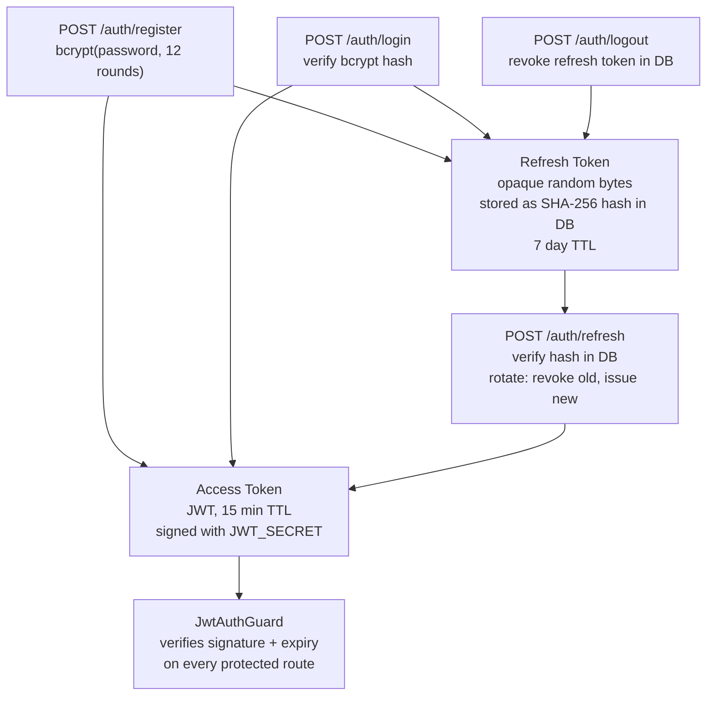
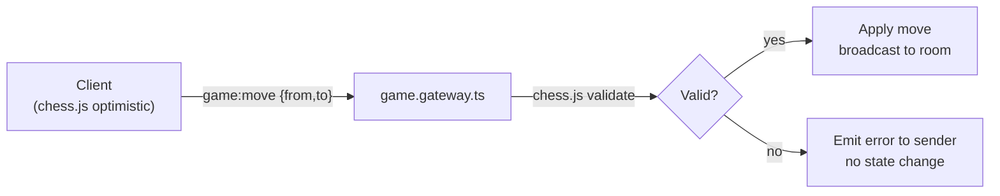

# Security

## Threat Model

ChessKernel is a user-facing web app with real-time features. Key attack surfaces:

- Authentication (credential theft, token forgery)
- Move validation (cheating, illegal moves)
- WebSocket events (unauthorized actions, room hopping)
- Input handling (injection via usernames, move payloads)
- Rate limiting (DoS, brute-force auth)

## Authentication



### Properties

- Access tokens are short-lived (15 min), so the exposure window is small
- Refresh tokens are opaque bytes, stored as SHA-256 hashes, so a DB breach does not leak raw tokens
- Refresh token rotation on every use, so stolen tokens are detected on next legitimate use
- Logout revokes the refresh token, which forces re-authentication

## Move Validation

All moves are validated **server-side** using `chess.js` regardless of what the client sends. The client uses chess.js optimistically for UI smoothness but cannot bypass server validation.



Illegal moves are rejected silently to the room; only the sender receives an error event. This prevents information leakage about the server's game state.

## WebSocket Authorization

Every WebSocket connection is authenticated via `WsAuthGuard`:

1. Client sends JWT in `socket.handshake.auth.token`
2. Guard verifies signature and expiry on `connection` event
3. User identity is attached to the socket for all subsequent events
4. Each handler checks that the acting user is a participant in the referenced game

Room joining is controlled server-side; clients cannot self-subscribe to arbitrary rooms.

## Input Validation

All HTTP request bodies are validated through NestJS's global validation pipe using `class-validator` decorators on DTOs. Requests that fail validation return `400 Bad Request` before reaching any service.

WebSocket event payloads are manually validated in gateway handlers.

### Key validation rules

| Field | Constraint |
|-------|-----------|
| username | 3-30 chars, alphanumeric + underscore |
| email | valid RFC email |
| password | min 8 chars |
| move.from / move.to | square regex `[a-h][1-8]` |
| gameId | UUID format |

## Rate Limiting

Nginx enforces rate limits per IP address at the reverse proxy layer:

| Endpoint group | Limit |
|---------------|-------|
| `POST /auth/*` | 10 req/min |
| `GET /api/*` | 300 req/min |
| WebSocket connections | 5 connects/min |

These limits prevent credential brute-force and basic DoS.

## Secret Management

No secrets are hardcoded. All sensitive values are loaded from environment variables at startup and validated with Zod:

| Variable | Purpose |
|----------|---------|
| `JWT_SECRET` | Access token signing key |
| `DATABASE_URL` | PostgreSQL connection string |
| `REDIS_URL` | Redis connection string |

Missing required variables cause the server to refuse to start with a clear error message.

## SQL Injection Prevention

All database access goes through Prisma ORM, which uses parameterized queries exclusively. No raw SQL is constructed from user input.

## CORS

The NestJS server restricts CORS to the configured `CLIENT_URL` origin. WebSocket connections follow the same policy via Socket.IO's `cors` option.

## Security Headers (Nginx)

```nginx
add_header X-Frame-Options DENY;
add_header X-Content-Type-Options nosniff;
add_header Referrer-Policy strict-origin-when-cross-origin;
add_header Content-Security-Policy "default-src 'self'; ...";
```

## Known Limitations / Future Work

| Item | Status |
|------|--------|
| Email verification | Schema supports it; flow not yet implemented |
| 2FA | Not implemented |
| Stockfish process isolation | Runs as app user; sandboxing (e.g. seccomp) not applied |
| Account rate limiting (per user, not IP) | Not implemented, relies on IP limits only |
